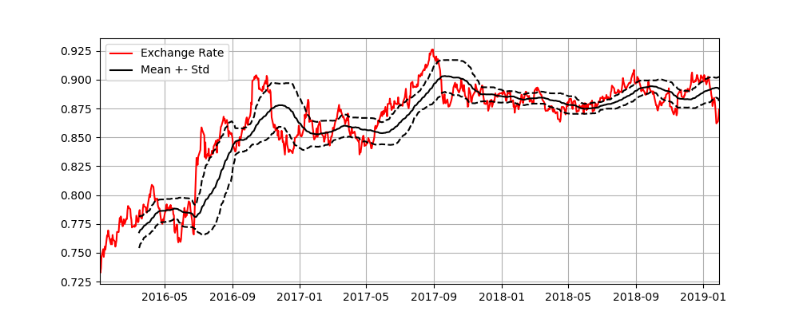
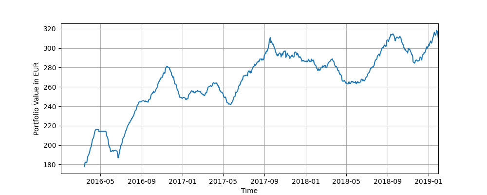

The Jupyter notebook for this project can be found [here](https://github.com/sundarganesh21/quantfin/tree/main/project1_fx_mean_reversion).
# FX Trading, Mean Reversion and Moving Averages

In this mini-project, we look into mean-reversion algorithms for FX trading. For some curency pairs whose countries have close economic and geographical ties (GBP-EUR, AUS-NZD), their exchange rate can be mean-reverting, i.e., short term fluctuations usually trend back towards a mean value. When an exchange rate displays such mean-reverting behaviour, a simple trading-strategy can be proposed where we buy/sell currency when there are large deviations of the exchange rate from its mean value, since we expect that it trends back to its mean value. 

## 1. Research Question and Analysis

### 1.1. Initial Analysis
The first question we aim to answer is the following - is the signal mean-reverting over any particular time window? If yes, what is the half-life of its mean-reversion? We want to know not just when/whether the signal reverts, but also how quickly it reverts. We work primarily with the EUR-GBP exchange rate in this analysis. We first want to test this on historical data, so let's pull up the last 20 years of EUR-GBP data at a frequency of 1 day. 

Just visually, we observe some mean-reversion from 2016 until around 2020-2021. However, we'd like to test this more concretely.

### 1.2. ADF Test for Mean-Reversion and Half-Life Extraction
Starting from 2005, we look at 3-year long windows, moving the window forwards by one quarter each time. For each snapshot, we run the Augmented Dickey-Fuller test. This confirms what we observed in the eyeball-norm, namely that from early 2016 to 2019, the ADF test predicts that the process is indeed mean reverting (see Jupyter notebook link above).

Now that we know the signal is mean-reverting, we wish to know how quickly it mean reverts. To this end, we fit an AR1 model on the time signal from 2016 to 2019. From the AR1 model coefficient, the half-life comes out to be 51 days. This half-life is very important for mean-reversion trading algorithms, as we'll see in the next section.

## 2. Trading Algorithm
### 2.1. Moving Averages
To use this signal for trading, we deploy a moving-average algorithm. Although the ADF test tells us that the signal reverts to a static mean value, this mean value may in practice change over time, albeit more slowly than the signal itself. To accommodate for this, we use a moving-average window rather than a fixed average value. 

The rationale behind the algorithm is quite straightforward. If the exchange rate is abnormally high, then 1 GBP is worth more EUR. So we buy EUR and sell GBP. When the exchange rate is abnormally low, 1 GBP is worth fewer EUR, so we sell EUR and buy GBP. We then need to decide two aspects of the algorithm - the 'when' and the 'how much'.

### 2.2. The 'When'
We use a Z-score to compute how far the exchange rate is from its mean value as follows: Z-score = (exchange rate - moving average )/(moving standard deviation). When the Z-score exceeds a critical value, we buy EUR/sell GBP. When the Z-score drops below a critical value, then we sell EUR/buy GBP. For this experiment, we set the critical value as +1 and -1 respectively. These can, in practice, be tuned by hyperparameter optimization during backtesting.

An important note here is that with FX, there is no notion of "asset" that you buy/sell using cash. Hence, there is often a necessity to treat one currency as the base currency and the other currency as the "asset" currency. When you hear "exit" in these contexts, it usually means that we buy/sell until we return the balance of our base currency to the value that it was when we entered the position. For this strategy however, we just assume that we hold balances in GBP and EUR, and that we convert in each direction depending on how the exchange rate moves.

### 2.3. The 'How Much'
Right, so we've defined when to buy and sell. The next question is - how much do we trade each time we get a signal to trade? There are multiple ways to do this. The first and most simple way is to trade the same fixed amount whenever we get a buy or sell signal. A consequence of this is that the longer the Z-score stays above/below its threshold values, the larger the position we take up. The second way is to trade an amount proportional to the Z-score. This way, the larger the departure is from the average value, the more you are willing to stake on the trade. We'll stick to the first algorithm in this project.

## 3. Backtesting and Performance Analysis
We use the data from 2016 to 2019 to test this trading algorithm. We begin with 100 units of EUR and 100 units of GBP. We trade 5 units of EUR whenever a buy or sell signal is triggered. The total value of the portfolio is computed in EUR - so it is the EUR balance plus the GBP balance converted using whatever the exchange rate is at that time stamp.

Firstly, let's plot the signal over its moving average plus and minus the critical value time standard deviation. Whenever the red line exceeds the upper limit, we buy EUR/sell GBP and whenever the red line exceeds the lower limit, we buy GBP/sell EUR. 

Then, let's look at the portfolio performance over the entire time period. The performance looks great! At first glance, we're looking at annualized returns of around 28.8%. However, we all know that returns is not the full picture. The strategy also produces a Sharpe ratio of around 1.8, which is often satisfactory for trading. 

## 4. Disclaimers and Drawbacks
This entire analysis is fully academic, and is riddled with reasons not to use it. I'm testing on the same data that I used for training. 
