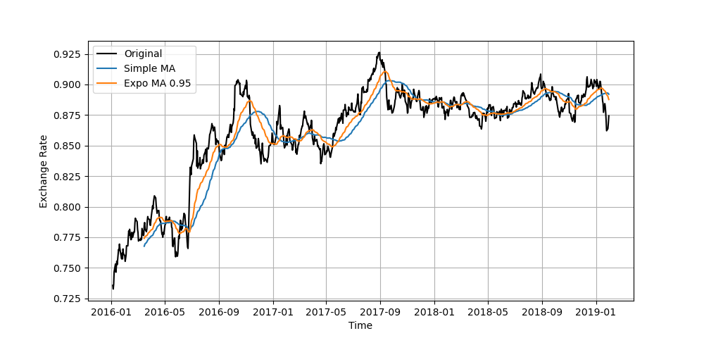

The Jupyter notebook for this project can be found [here](https://github.com/sundarganesh21/quantfin/tree/main/project2_fx_mean_reversion_part2).

# Project 2: Mean Reversion Algorithms - Part 2: Improvements

## 1. Research Question
Now that we have a basic strategy, let's explore some improvements to this strategy. In this article, we mainly want to explore the following improvements:
- Using exponential weighted averages rather than moving averages
- Changing the strategy to trade proportional to the Z-score, rather than using a constant amount throughout

## 2. First improvement: Weighted moving average
The simple moving average that we've used in Part 1 used equal weights for all points in the 51-day moving average window. Instead, we propose using an exponential weighted average, where the weights decay geometrically by a factor $0 < \alpha < 1$:

$$\mu_{i} = \frac{1}{W} \left[ x_i + \alpha x_{i-1} + \alpha^2 x_{i-2} + ... + \alpha^n x_{i-n} \right]$$

where  $W = \sum_{j=0}^n \alpha^j$. It's important that for any moving average, the weights must sum up to 1 in order to maintain the unbiased nature of the estimator; hence the leading $1/W$ factor. One can also see that as $\alpha \rightarrow 1$, we get back the simple average, whereas for $\alpha \rightarrow 0$, we simply use just the last point in the moving average, recovering the true signal. To see this, let's compute the exponential moving average and compare it to the simple moving average on a plot.

Let's now run the same trading strategy as in Part 1 with just one modification - changing the moving average from simple to exponential with different coefficients $\alpha$. This analysis can be found in the associated Jupyter notebook. The results are tabulated below. At first glance, it looks as if exponential moving averages actually significantly worsen our returns. To examine why, we simply examine the plot above. Since the exponential moving average biases the average towards more recent samples, the exponential moving average curve more closely follows the original signal. However, we are still using a simple moving standard deviation to compute the Z-score. This means that the critical score value needs to be smaller to actually trigger meaningful trades and signal thresholds. 

| $\alpha$ | Sharpe Ratio | Annualized Returns % |
| -------- | ------------ | -------------------- |
| 1.0      | 1.89         | 28.78                |
| 0.95     | 0.46         | 9.97                 |
| 0.9      | 0.08         | 6.03                 |
| 0.8      | -0.08        | 4.62                 |
| 0.6      | -0.29        | 2.52                 |
| -------- | ------------ | -------------------- |

To rectify this issue, we analyze the effects of using lower values of $Z_{crit}$ for trading, for a fixed value of $\alpha=0.95$. As can be seen from the tabulated values below, reducing $Z_{crit}$ indeed improves performance. However, performance once again degrades for a critical Z-score that's too small. The other factor to consider during hyper-parameter optimization is naturally also trading costs - smaller Z-scores mean more frequent trades, which means more trading costs. 

| $Z_{crit}$ | Sharpe Ratio | Annualized Returns % |
| ---------- | ------------ | -------------------- |
| 1.0        | 0.46         | 9.97                 |
| 0.5        | 1.49         | 23.82                |
| 0.25       | 1.84         | 30.79                |
| 0.125      | 1.75         | 30.60                |
| 0.0625     | 1.68         | 29.625               |
| ---------- | ------------ | -------------------- |

